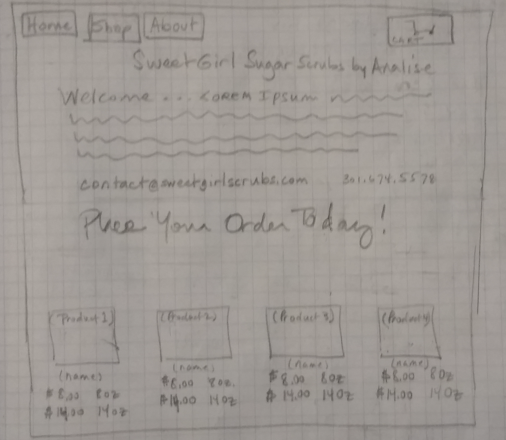
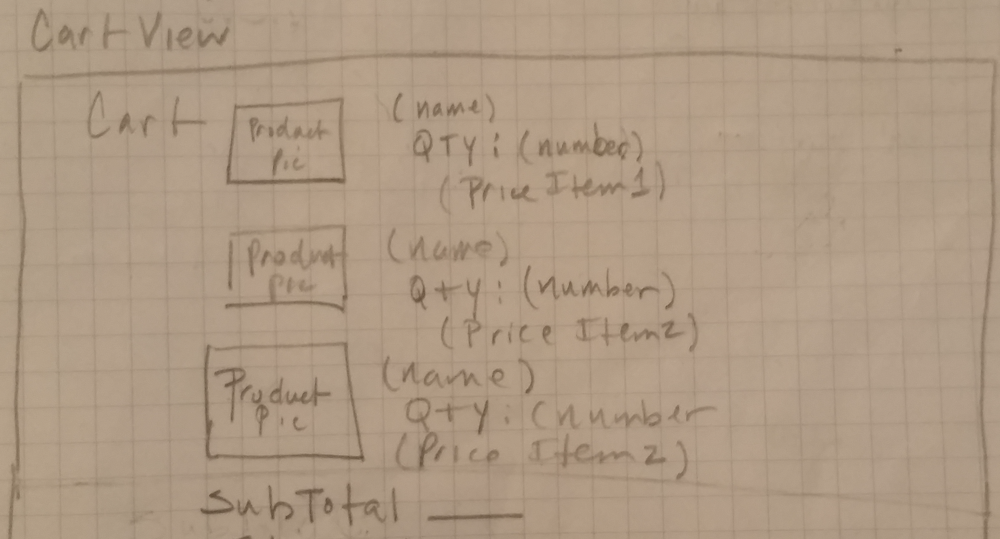
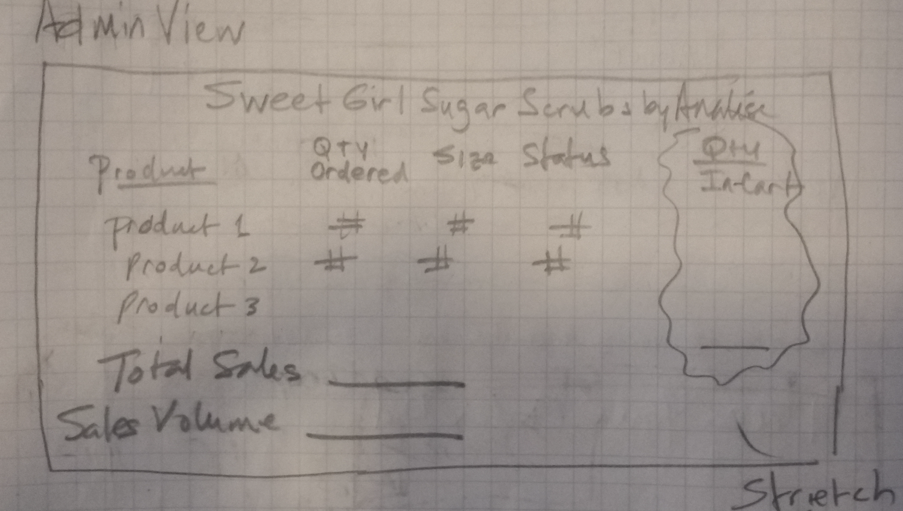
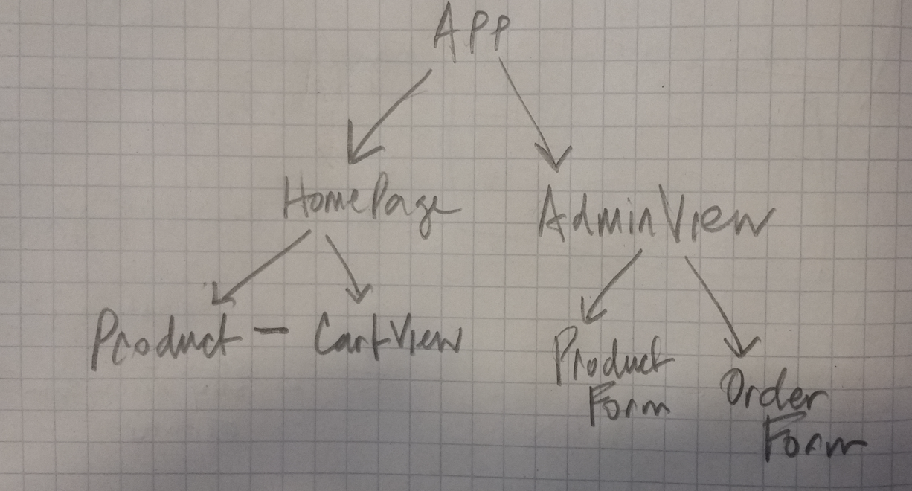

# Project-3: Building My First MERN-stack Application

## Overview

The goal of this project was to utilize the MERN stack to develop a web application for an online marketplace.  Deployment of the retail store App (SweetGirl SugarScrubs), as the developer-defined MVP, was effected via Heroku.  The completed project may be accessed using the link provided (below). 

**Live site demo:** <https://sleepy-shore-80246.herokuapp.com/home>

## Technologies Used

* Languages - React, MongoDB, Mongoose, Express, Node JS, Javascript, HTML5 & CSS3 
* Text Editor - Visual Studio Code v.1.33.0
* User Stories, Project Planning & Progress Tracking via [Trello](https://trello.com/invite/b/XwfQGkLd/b4c4dc0580791f20c35d674e2dd5a27a/ga-sei-21-project-3)
* Designed and executed utilizing the methodologies, lessons, exercises and other information as provided over the course of GA's Software Engineering Immersive program (SEI-21) 

## Wireframe

## WhiteBoard

## Main Application Process & Related Details

SweetGirl Sugar Scrubs by Analise is a line of skin care products for all ages featuring only natural ingredients, crafted by hand in small sized batches. This web application provides an online retail experience so shoppers can order (purchase) products; and, aggregates relevent business data for the owner to manage the production and shipping operations associated with those orders. 

The 'APP' has been structured utilizing the Model-View-Controller (MVC) pattern. React's JS library for building dynamic (interactive / reactive) user interfaces (UIs) serves as its front-end View layer.  And, our back-end uses the Express JS framework (running on top of Node JS) on the server.  Among other things, it controls the routing of tasks associated with receiving incoming requests from the client, performing predefined tasks, and returning responses to the client. The back-end also employs MongoDB, a document database, to store the data as JSON documents.

Best practices in terms of following F.I.R.S.T guidelines for React components (i.e., focused, independent, reusable, small & testable) and for defining _RESTful_ routes using HTTP protocal. Full CRUD (Create, Read, Update & Delete) capability exists for model APIs (Scrubs and Orders). AJAX (Asynchronous Javascript and XML)requests are handled via the Axios, the Promise-based HTTP client, to update the database and receive information back from the server without having to refresh the browser. 

## Features

When combined with the above mentioned processes, shoppers and other users of the SweetGirl SugarScrubs website should have a faster, more responsive experience given the following features: 

* Single Page Application (SPA), client-side rendering of data via React
* Utilizes Node.js along with ExpressJS to set up and configure a server that listens for HTTP requests from your browser.
* Mongoose, the object document mapping (ODM) library, is used to facilitate getting data in and out the nosql database MongoDB.

## Future Development

* Improve the CartView component (1) to indicate number of items in the shopping cart, showing that number in the cart icon; and (2) to display in separate cart items page; 
* Develop shopper accounts, usernames and logins;
* Setup model for collection and online payment processing (viz. Square, PayPal, Stripe...); 
* Add features to view items in-cart that have not yet been ordered;
* Build out ShopView to show each product's details individually;
* Rework orders DB

 